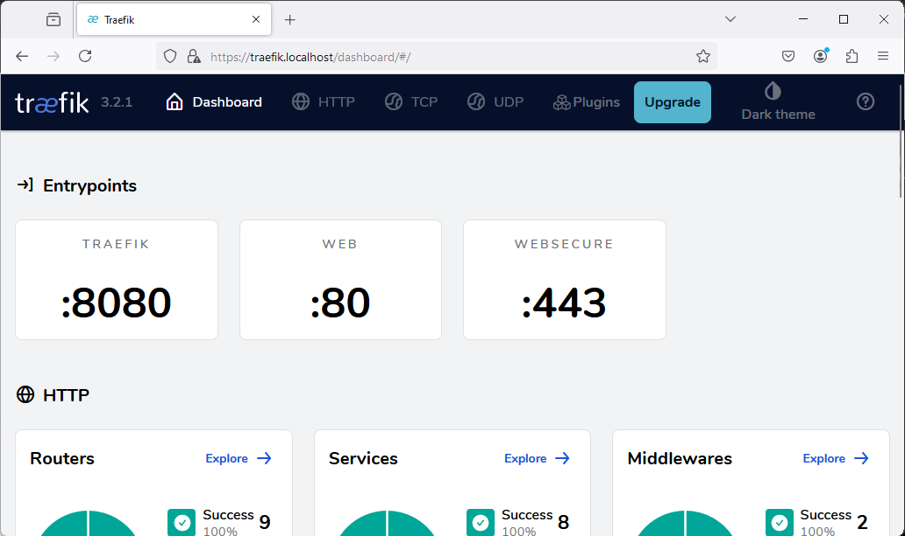

# Dockerized Web Application Environment  

This project sets up a Dockerized web application environment on a Debian-based machine, combining several key services to provide a fully functional stack:  
- **Apache**: Serves static and dynamic web content.  
- **MariaDB**: Provides the database backend.  
- **phpMyAdmin**: Allows for database management via a web interface.  
- **Traefik**: Functions as a reverse proxy with HTTPS and Let's Encrypt integration.  
- **OpenSSL**: Generates self-signed SSL certificates for secure communication.

These services are containerized using Docker for easy deployment and management.

---

## Application Overview  

The application hosts both static (`index.html`) and dynamic (`index.php`) content. It interacts with a MariaDB database to display data on the PHP page. **phpMyAdmin** offers a convenient interface for managing the database, while sensitive credentials are secured using **Docker secrets**.

**Here's my landing page:**
<br>
**Here's my dynamic page:**


---

## Dockerized Services  

### 1. **Traefik**  
Traefik is the reverse proxy, handling incoming requests and routing them to the correct services. It automatically configures HTTPS with **Let's Encrypt** for SSL certificate management. Traefik also provides a **dashboard** for monitoring the health and performance of services.

**Config Example**: Traefik uses Docker labels to route traffic (e.g., `web.localhost`) and configure HTTPS for services.

**For my web pages :**
 

 

---

### 2. **MariaDB**  
MariaDB is a MySQL-compatible database that stores and serves data to the web application. It is initialized with an `init.sql` script, which automates the database setup.

**Configuration**:  
My `init.sql` script creates a database called `sre-database`, within which it creates a table called `sre-table` and inserts sample data:

```sql
CREATE DATABASE IF NOT EXISTS `sre-database`;
USE `sre-database`;

CREATE TABLE IF NOT EXISTS `sre-table` (
    id INT AUTO_INCREMENT PRIMARY KEY,
    name VARCHAR(50) NOT NULL
);

INSERT INTO `sre-table` (name) VALUES ('Mostafa'), ('Louise'), ('Thomas');
```

This database serves data to the `index.php` file, which displays it on the web page.

---

### 3. **Apache**  
Apache serves static and dynamic content and is configured for HTTPS using a self-signed SSL certificate generated with **OpenSSL**. Traefik handles SSL certificate management.

**Configuration**:
First, Apache is installed using the Dockerfile as shown below:


Then, it is enabled and runs in the background on my Debian machine with the following command:

    CMD ["apache2ctl", "-D", "FOREGROUND"]

 Apache configuration includes enabling SSL and setting the certificate path, while Traefik routes traffic securely.

---

### 4. **phpMyAdmin**  
phpMyAdmin provides a web interface for managing MariaDB. It’s accessed via a subdomain (e.g., `pma.localhost`) and secured with HTTPS for safe communication.

**Preview**: 

---

### 5. **OpenSSL**  
OpenSSL is used to generate **self-signed SSL certificates** for Apache, enabling HTTPS. While Traefik automates certificate management, OpenSSL is used for local development or custom certificates.

**Configuration**:

First, I created a directory called ssl where I can generate my keys, then I enabled SSL with the a2enmod command.


---
### 6. **Healthcheck & Secrets**:

This Docker Compose file includes **health checks** to monitor service status, such as checking Traefik's API, MariaDB’s database connection, and the accessibility of the web and phpMyAdmin pages. If any service fails, Docker will automatically restart it.

**Docker Secrets** are used to securely manage sensitive data, like the MySQL root password. The password is stored in a file and referenced by the db and phpmyadmin services, keeping credentials secure.

## Accessing the Services  

Once the environment is running, the services can be accessed through the following URLs:  
- **Web Application**: `http://web.localhost` or `https://web.localhost`  
- **phpMyAdmin**: `http://pma.localhost` or `https://pma.localhost` or `http://localhost:8081`
- **Traefik Dashboard**: `http://traefik.localhost` or `https://traefik.localhost`

---

## Conclusion  

This Dockerized environment is the foundation of my final project. It utilizes Traefik for efficient traffic routing, MariaDB as the database backend, and phpMyAdmin for easy database management. The setup is designed to simplify deployment and ensure security through HTTPS and Docker secrets. It showcases my ability to configure and manage a robust, pre-configured web hosting environment, making it a valuable tool for developers and administrators.
